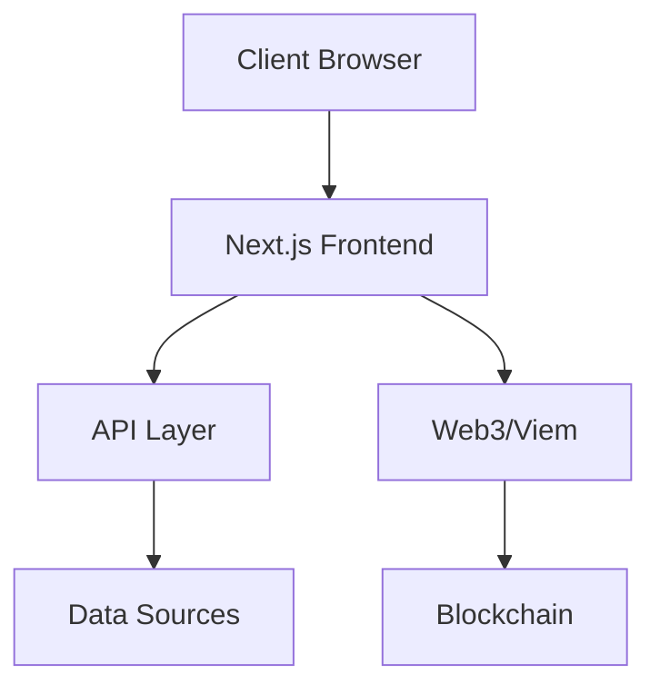

# Giveth Analytics Dashboard

## 1. Project Overview

### Purpose

The Giveth Analytics Dashboard is a web application that provides data visualization and analytics capabilities for the Giveth ecosystem. It helps track and analyze various metrics and data points related to Giveth's operations and impact.

### Key Features

-   Interactive data visualizations using Highcharts
-   Date-based filtering and analysis
-   Responsive design with styled-components
-   Integration with Giveth's UI design system
-   Real-time data updates
-   Web3 integration using Viem

### Live Links

-   Development: http://localhost:3000
-   [Add production/staging URLs once available]

## 2. Architecture Overview

### System Diagram



### Tech Stack

-   **Frontend Framework**: Next.js 13
-   **UI Library**: React 18
-   **Styling**: Styled Components, Giveth UI Design System
-   **Charts**: Highcharts
-   **Web3**: Viem
-   **Language**: TypeScript
-   **Development Tools**: ESLint, Prettier

### Data Flow

1. User interacts with the dashboard interface
2. Next.js handles client-side routing and data fetching
3. Data is processed and visualized using Highcharts
4. Web3 interactions are managed through Viem
5. UI updates are reflected using React's state management

## 3. Getting Started

### Prerequisites

-   Node.js (v16 or higher recommended)
-   Yarn package manager
-   Git
-   Web3 wallet (for blockchain interactions)

### Installation Steps

1. Clone the repository:

```bash
git clone [repository-url]
cd analytics-dashboard
```

2. Install dependencies:

```bash
yarn install
```

3. Set up environment variables:
   Create a `.env.local` file with necessary environment variables (if required)

### Configuration

-   The project uses Next.js configuration in `next.config.js`
-   Styling is configured with styled-components
-   ESLint and Prettier are configured for code quality

## 4. Usage Instructions

### Running the Application

Development mode:

```bash
yarn dev
```

Production build:

```bash
yarn build
yarn start
```

### Testing

```bash
# Add testing commands once implemented
```

### Common Tasks

-   **Code Linting**: `yarn lint`
-   **Fix Linting Issues**: `yarn lint:fix`

## 5. Deployment Process

### Environments

-   Development: Local development environment
-   [Add staging/production environment details once available]

### Deployment Steps

1. Ensure all dependencies are installed:

```bash
yarn install
```

2. Build the application:

```bash
yarn build
```

3. Start the production server:

```bash
yarn start
```

### CI/CD Integration

[Add CI/CD details once implemented]

## 6. Troubleshooting

### Common Issues

1. **Build Errors**

    - Ensure all dependencies are installed
    - Check Node.js version compatibility
    - Verify environment variables are set correctly

2. **Styling Issues**
    - Check styled-components configuration
    - Verify UI Design System version compatibility

### Logs and Debugging

-   Use browser developer tools for frontend debugging
-   Check Next.js build output for deployment issues
-   Enable React Developer Tools for component debugging

## Contributing

[Add contribution guidelines]

## License

UNLICENSED

## Authors

-   Ramin Ramazanpour
