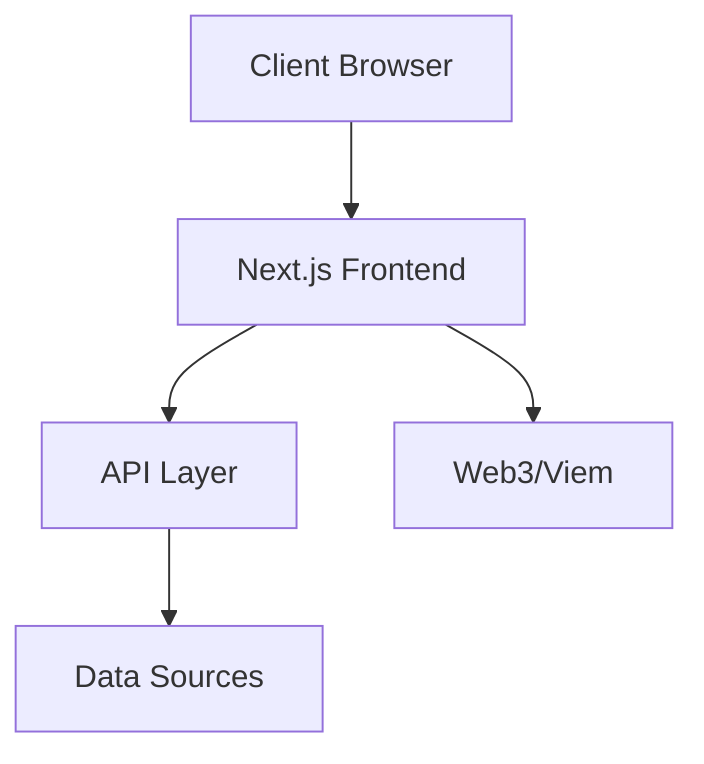

# Giveth Analytics Dashboard

## 1. Project Overview

### Purpose

The Giveth Analytics Dashboard is a web application that provides data visualization and analytics capabilities for the Giveth ecosystem. It helps track and analyze various metrics and data points related to Giveth's operations and impact.

### Key Features

-   Interactive data visualizations using Highcharts
-   Date-based filtering and analysis
-   Responsive design with styled-components
-   Integration with Giveth's UI design system
-   Real-time data updates
-   Web3 integration using Viem

### Live Links

-   Development: [https://staging.stats.giveth.io/](https://staging.stats.giveth.io/)
-   Production: [https://stats.giveth.io/](https://stats.giveth.io/)

## 2. Architecture Overview

### System Diagram


```mermaid
graph TD
    A[Client Browser] --> B[Next.js Frontend]
    B --> C[API Layer]
    C --> D[Data Sources]
    B --> E[Web3/Viem]
```

### Tech Stack

-   **Frontend Framework**: Next.js 13
-   **UI Library**: React 18
-   **Styling**: Styled Components, Giveth UI Design System
-   **Charts**: Highcharts
-   **Web3**: Viem
-   **Language**: TypeScript
-   **Development Tools**: ESLint, Prettier

### Data Sources

Tabs with a v6 future come in pairs. The "v5 …" tabs read the legacy backend (impact-graph); their "v6 …" twins run the same queries against giveth-v6-core (`V6_BACKEND_LINK` in `src/configuration.ts`; set `NEXT_PUBLIC_ENV=local` to point them at a local giveth-v6-core on `http://localhost:4000`). Tabs marked "(legacy)" have no v6 counterpart.

v6 imports v5's data, so for date ranges before v6 went live (qf.giveth.io) a pair matches closely except for the gaps below; since then v6 also reads higher by its own activity. Any other large gap points at the sync. These gaps are expected and are not drift:

-   v6 has activity of its own: donations and projects made on qf.giveth.io exist only in v6, and nothing copies them back to v5. For any range since v6 went live, every v6 tab reads higher than its v5 twin by that activity, and during a QF round on qf.giveth.io the gap can be large.
-   v6 imports only verified v5 donations, but three stats count donations of every status, as v5 does: new donors (count and USD), distribution of tokens by unique donors, and the donation box metrics. For as long as v5 takes donations, v5's pending and failed donations are missing from v6, which pulls these lower. For new donors, a donor whose first v5 attempt failed counts as new later in v6, at their first verified donation, and one whose v5 attempts all failed never appears.
-   v6 never imports v5's draft projects (or donations to them), so v6's "projects created per month" chart sits somewhat below v5's for v5 activity. The project total counts active projects only and is unaffected.
-   On staging (`NEXT_PUBLIC_ENV=development`) the pairs are not comparable at all: v6 staging does not import v5 projects or Endaoment membership, so the v6 Projects tab does not track v5 and "endaoment projects only" is always empty.

### Data Flow

1. User interacts with the dashboard interface
2. Next.js handles client-side routing and data fetching
3. Data is processed and visualized using Highcharts
4. Web3 interactions are managed through Viem
5. UI updates are reflected using React's state management

## 3. Getting Started

### Prerequisites

-   Node.js (v16 or higher recommended)
-   Yarn package manager
-   Git
-   Web3 wallet (for blockchain interactions)

### Installation Steps

1. Clone the repository:

```bash
git clone [repository-url]
cd analytics-dashboard
```

2. Install dependencies:

```bash
yarn install
```

3. Set up environment variables:
   Create a `.env.local` file with necessary environment variables (if required)

### Configuration

-   The project uses Next.js configuration in `next.config.js`
-   Styling is configured with styled-components
-   ESLint and Prettier are configured for code quality

## 4. Usage Instructions

### Running the Application

Development mode:

```bash
yarn dev
```

Production build:

```bash
yarn build
yarn start
```

### Common Tasks

-   **Code Linting**: `yarn lint`
-   **Fix Linting Issues**: `yarn lint:fix`

## 5. Deployment Process

### Environments

-   Development: Local development environment
-   [Add staging/production environment details once available]

### Deployment Steps

1. Ensure all dependencies are installed:

```bash
yarn install
```

2. Build the application:

```bash
yarn build
```

3. Start the production server:

```bash
yarn start
```

### CI/CD Integration

[Add CI/CD details once implemented]

## 6. Troubleshooting

### Common Issues

1. **Build Errors**

    - Ensure all dependencies are installed
    - Check Node.js version compatibility
    - Verify environment variables are set correctly

2. **Styling Issues**
    - Check styled-components configuration
    - Verify UI Design System version compatibility

### Logs and Debugging

-   Use browser developer tools for frontend debugging
-   Check Next.js build output for deployment issues
-   Enable React Developer Tools for component debugging

## License

UNLICENSED

## Authors

-   Ramin Ramazanpour
